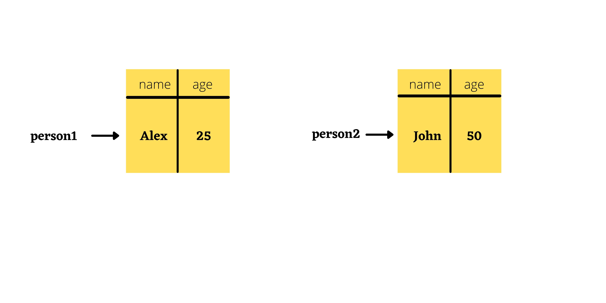

1. What will be the output and explain the reason.

```js
let obj = { name: "Arya" };
obj = { surname: "Stark" };
let newObj = { name: "Arya" };
let user = obj;
let arr = ["Hi"];
let arr2 = arr;
```

Answer the following with reason after going through the above code:

- `[10] === [10]` // False
- What is the value of obj? //{surname : 'Stark' }
- `obj == newObj` // False
- `obj === newObj` // False
- `user === newObj` // False
- `user == newObj` // False
- `user == obj` // True
- `arr == arr2` // True
- `arr === arr2` // True

2. What's will be the value of `person1` and `person2` ? Explain with reason. Draw the memory representation diagram.

<!-- To add this image here use  -->



```js
function personDetails(person) {
  person.age = 25;
  person = { name: "John", age: 50 };
  return person;
}
var person1 = { name: "Alex", age: 30 };
var person2 = personDetails(person1);
console.log(person1); // { name: "Alex", age: 25}
console.log(person2); // { name: "John", age: 50 };
```

3. What will be the output of the below code:

```js
var brothers = ["Bran", "John"];
var user = {
  name: "Sansa",
};
user.brothers = brothers;
brothers.push("Robb");
console.log(user.brothers === brothers); // True
console.log(user.brothers.length === brothers.length); //True
```


